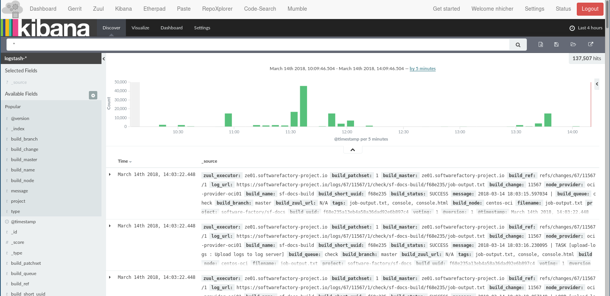

.. _log_management:

Jobs log management
===================

On Software Factory, a stack could be deployed to provide log management for
CI/CD jobs. When the stack is activated, the following components are deployed:

* `Elasticsearch <https://www.elastic.co/products/elasticsearch>`_: RESTful search and analytics engine.
* `Logstash <https://www.elastic.co/products/logstash>`_: server-side data processing pipeline.
* `Kibana <https://www.elastic.co/products/kibana>`_: to visualize your Elasticsearch data.

As operator, you can understand how the logging system is implemented on
Software Factory and how to to activate it by following the :ref:`operator
documentation <elk-operator>`.

..
   TODO add user documentation
   As users, you can have a look to the :ref:`user documentation <elk-user>`
   to understand how to use or add dashboards.
