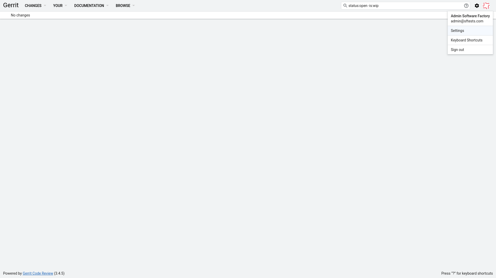

.. _how_to_setup_sf_sandbox:

How to setup Software Factory sandbox
-------------------------------------

In this section, we will explain how to setup a sandbox to play with Software
Factory component. You have to setup a virtual machine with a centos 7 image.
The following documentation explain how to quickly setup a virtualbox host.

Create virtual machine
......................
The first step is to create a CentOS 7 virtual machine.

* download the `centos minimal iso <https://www.centos.org/download/>`_
* create the virtual machine using VirtualBox Manager with:

- 20G hdd
- 4G ram
- hostname: sftests.com

After the installation, stop the virtual machine to finalise the configuration.
The easier solution to access to your instance from your terminal and browser is
to create a second interface within the settings of the virtual machine with the
type *Host-only adaptater*. Then start the virtual machine, and use *ip address*
to get the network configuration:

.. code-block:: bash

  [root@managesf.sftests.com ~]# ip a
  1: lo: <LOOPBACK,UP,LOWER_UP> mtu 65536 qdisc noqueue state UNKNOWN group default qlen 1000
      ...
  2: enp0s3: <BROADCAST,MULTICAST,UP,LOWER_UP> mtu 1500 qdisc pfifo_fast state UP group default qlen 1000
      link/ether 08:00:27:c5:69:3c brd ff:ff:ff:ff:ff:ff
      inet 10.0.2.15/24 brd 10.0.2.255 scope global noprefixroute dynamic enp0s3
         valid_lft 85327sec preferred_lft 85327sec
  3: enp0s8: <BROADCAST,MULTICAST,UP,LOWER_UP> mtu 1500 qdisc pfifo_fast state UP group default qlen 1000
      link/ether 08:00:27:23:d3:1b brd ff:ff:ff:ff:ff:ff
      inet 192.168.56.102/24 brd 192.168.56.255 scope global noprefixroute dynamic enp0s8
         valid_lft 1133sec preferred_lft 1133sec

Configure access to the virtual machine
.......................................

Add the ip and hostname in your /etc/hosts file

.. code-block:: bash

  192.168.56.102 sftests.com

Configure the virtual machine
.............................

Connect to your virtual machine from your host

.. code-block:: bash

  ssh root@sftests.com

and disable firewalld service

.. code-block:: bash

  systemctl stop firewalld
  systemctl disable firewalld

Install Software Factory
........................

.. code-block:: bash

  yum install -y https://softwarefactory-project.io/repos/sf-release-3.0.rpm
  yum update -y
  yum install -y sf-config
  echo '      - hypervisor-oci' >> /etc/software-factory/arch.yaml
  sfconfig --enable-insecure-slaves

Validate http access
....................

Connect to *https://sftests.com* to access to the software factory web interface

.. figure:: imgs/sf_dashboard.png
   :width: 80%

Configure admin public ssh key
..............................

The next step is to add your ssh pub key to the admin account to be able to
propose review. The admin password is defined in
*/etc/software-factory/sfconfig.yaml file* (the default password is *userpass*).
Go to *https://sftests.com/auth/login* using *Toggle login form* with the admin
account. Then go to *https://sftests.com/r/#/dashboard/self*. Edit the setting
on the gerrit admin account:

Select *SSH Public Keys* and add your public key (Do not delete the other
defined key).

Snapshot the virtual machine
............................

You can now snapshot the virtual machine to be able to quickly restore a know
state after testing.
