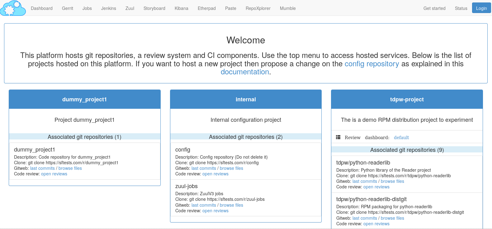

============================================
Welcome to software-factory's documentation!
============================================

Software Factory (also called SF) is a collection of services that provides
a powerful platform to build software. It's designed to
use an OpenStack-based cloud for resources, but it can also be used with static
resources.

Setting up a development environment manually can really be
time consuming and sometimes leads to a lot of configuration
trouble. SF provides an easy way to get all services configured
and running.

SF feature an automated upgrade process continuously tested with integration test.

SF integrates services matching each step in the software
production chain:

* Code review system
* Pipelines manager
* Test instance management
* Task tracker
* Collaborative tools
* Repositories metrics
* Log management
* System metrics

SF offers a seamless user experience with:

* Single Sign-On authentication,
* Unified REST API,
* Top-menu to access all the services, and
* Command line tool and web interface.

Table of contents
=================

.. toctree::
   :maxdepth: 1

   main_components
   user/user
   operator/operator
   contributor/contributor
   faqs
