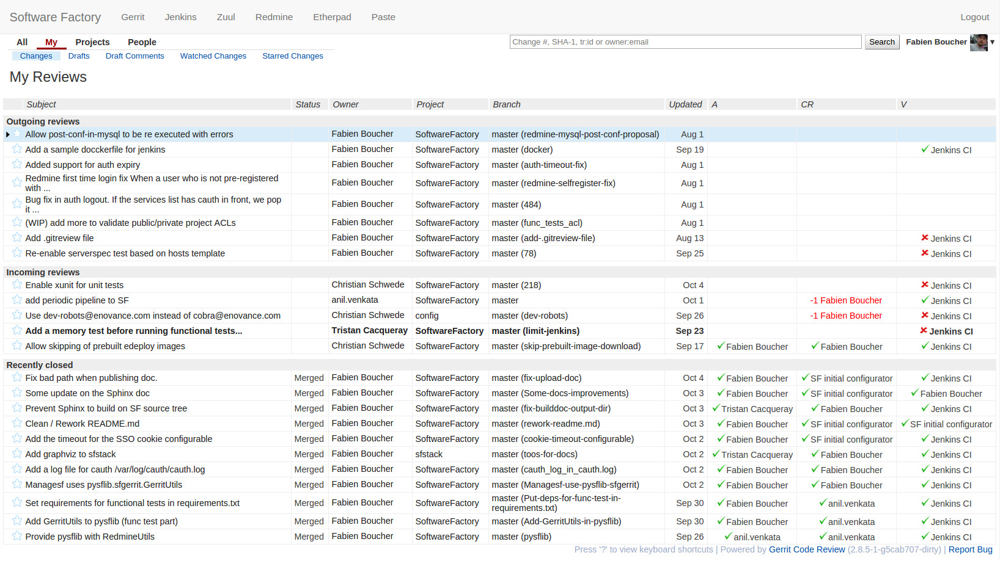
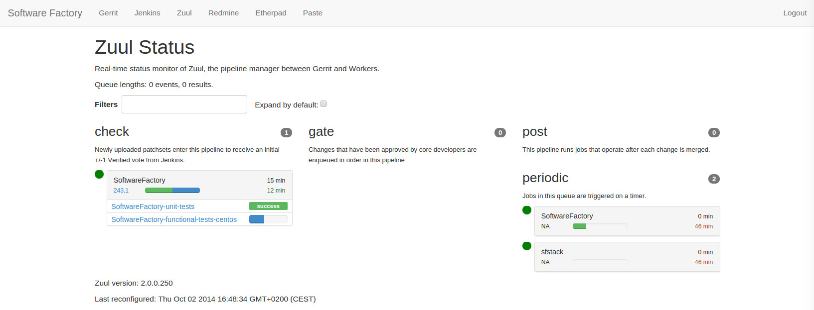
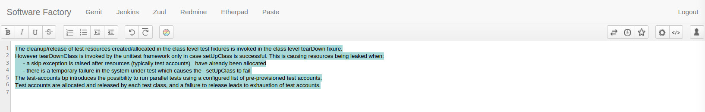
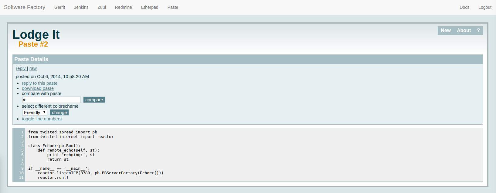

.. TODO: Most configuration settings are available to all user through a special project called config,
.. or "config repo". Modifications are proposed through Code-Review and integrated through SF
.. integration pipeline using a special job called config-update.

Main components
===============

Code review system
------------------

`Gerrit <http://en.wikipedia.org/wiki/Gerrit_%28software%29>`_ is the main
component of SF. It provides the Git server, a code review mechanism, and a
powerful ACL system. SF configures Gerrit to integrate correctly with the
issues tracker and the CI system (Jenkins/Zuul).

Some useful plugins are installed on Gerrit:

* Reviewer-by-blame: Automatically adds code reviewers to submitted changes according
  to git-blame result.
* Replication: Add replication mechanism to synchronize internal Git repositories
  to remote location.
* Gravatar: Because sometimes it is quite fun to have its gravatar along its
  commits and messages.
* Delete-project: Let the admin the ability to fully remove an useless Gerrit project.
* Download-commands: Ease integration of Gerrit with IDE

Some Gerrit hooks are installed to handle Storyboard issues:

* An issue referenced in a commit message will be automatically
  set as "In progress" in Storyboard.
* An issue referenced by a change will be closed when Gerrit merges it.

Gerrit is configured to work with Zuul and Jenkins, that means
project tests can be run when changes are proposed to a project.
Tests results are published on Gerrit as a note and can
prevent a change to be merged on the master branch.

Pipelines manager
-----------------

On SF `Zuul <http://ci.openstack.org/zuul/>`_ is by default configured to provide four pipelines:

* A check pipeline
* A gate pipeline
* A post pipeline
* A periodic pipeline

Test instance management
------------------------

`Nodepool <http://docs.openstack.org/infra/system-config/nodepool.html>`_ is a
test instances manager. It is design to provision and maintain one or more
pools of slave. An OpenStack cloud account is needed to allow nodepool to store
images/snapshot and start slave VMs. Within SF Nodepool is already pre-configured
to run together with Zuul.

Task tracker
------------
`Storyboard <http://docs.openstack.org/infra/storyboard/>`_

.. TODO description + image

Collaborative tools
-------------------

Software Factory deploys along with Storyboard, Gerrit and Zull some
additional collaboration tools:

* `Etherpad <http://en.wikipedia.org/wiki/Etherpad>`_ where team members can
  live edit text documents to collaborate. This is really handy for instance to
  brainstorm of design documents.

.. TODO check if we use etherpad or etherpad-lite

* `Lodgeit <http://www.pocoo.org/projects/lodgeit/>`_, is a pastebin like tool
  that facilitates rapid sharing of code snippets, error stack traces

* Mumble

.. TODO

Projects metrics
----------------

`Repoxplorer <https://github.com/morucci/repoxplorer>`_

.. TODO

Log management
--------------

* ARA

.. TODO

* ELK

.. TODO

* Log server

.. TODO

Platform metrics
----------------

* Influxdb

.. TODO

* Telegraf

.. TODO

* Grafana

.. TODO
