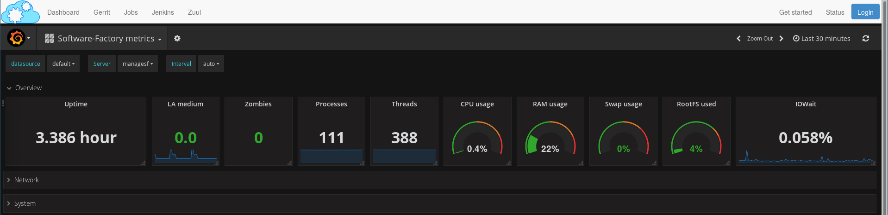

.. _metric_operator:

System metrics
==============

WIP

How to activate
---------------

These components are not deployed by default but can be activated by adding
them in */etc/software-factory/arch.yaml*:

.. code-block:: yaml

 - influxdb
 - grafana

Then running:

.. code-block:: bash

 # sfconfig.py

Dashboards
----------

WIP
