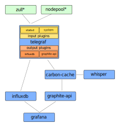

:orphan:

.. _metric_operator:

Architecture
============

System metrics
==============

You can activate system metrics on your deployment, 3 services will be
deployed:

* telegraf: an agent collecting system metrics on all nodes defined in the
  architecture file (/etc/software-factory/arch.yaml).
* influxdb: a time series to store the metrics.
* grafana: a dashboard to visualize metrics.

These services are used to provide a default system metrics dashboard for all
servers declared in arch.yaml.

Zuul and Nodepool metrics
=========================

By default, zuul and nodepool services will send metrics to a statsd server.
Statsd service is provided by telegraf, using telegraf statsd_ input plugins.

.. _statsd: https://github.com/influxdata/telegraf/tree/master/plugins/inputs/statsd

How to activate
---------------

These components are not deployed by default but can be activated by adding
them in */etc/software-factory/arch.yaml*:

You can deploy grafana and influxdb on a separated host if needed, but grafana
should be on the same host than the gateway role. Telegraf will be
automatically deployed on all nodes defined in the arch.yaml file.

.. code-block:: yaml

 - influxdb
 - grafana

Then running sfconfig to deploy all components:

.. code-block:: bash

 # sfconfig

Dashboards access
-----------------

There is a new item on the top menu, on the right side named "Status" to access
the grafana dashboard:

.. image:: ../imgs/metrics.png
   :scale: 50 %

A default dashboard is installed when activate influxdb and grafana role.

By default, all dashboards are read only. Only the admin user can add or modify
a dashboard.
