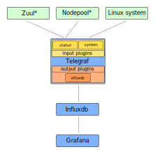
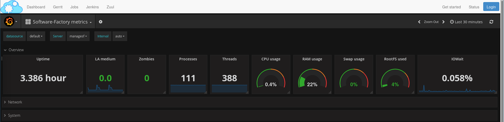

.. _metrics_operator:

System and Services metrics
===========================

Architecture
------------

Software Factory provides systems metrics and nodepool and zuul services metrics. The
following diagram describes the components used to provide metrics

When you activate metrics on your deployment, 3 services will be deployed:

* telegraf: a plugin based agent. Metrics are collected on all nodes defined in
  the architecture file (/etc/software-factory/arch.yaml). An input plugin is
  configured to get statsd metrics from zuul and nodepool services.
* influxdb: a time series database for storing metrics.
* grafana: a platform for data visualization.

Deployment
----------

These components are not deployed by default but can be activated by adding
them in */etc/software-factory/arch.yaml*:

You can deploy grafana and influxdb on a separated host if needed. Telegraf will be
automatically deployed on all nodes defined in the arch.yaml file.

.. code-block:: yaml

   inventory:
      - name: managesf
        ip: 192.168.0.10
        roles:
          ...
          - influxdb
          - grafana

Then run :ref:`sfconfig  <configure_reconfigure>` to deploy all components.

During the deployment, a database named *telegraf* will be created, configured
to allow *telegraf* user to send data.

Influxdb database
-----------------

Admin user can use influx client to connect to influxdb:

.. code-block:: bash

   # telegraf_passwd=$(awk '/telegraf_influxdb_password/ {print $2}' /var/lib/software-factory/bootstrap-data/secrets.yaml)
   # influx -ssl -host $influxdb_host -username telegraf -password $telegraf_passwd -database telegraf
   Connected to https://$influxdb_host:8086 version 1.4.2
   InfluxDB shell version: 1.4.2
   >

Explore telegraf database
^^^^^^^^^^^^^^^^^^^^^^^^^

* list measurements and series

.. code-block:: bash

   > show measurements limit 5
   name: measurements
   name
   ----
   cpu
   disk
   diskio
   kernel
   mem

* Query data

Influx queries are similar to sql syntax, it's fully explained on the `official
cli documentation <https://docs.influxdata.com/influxdb/v1.4/tools/shell/>`_.

.. code-block:: bash

   > select * from "zuul.tenant.local.pipeline.check.total_changes" limit 1
   name: zuul.tenant.local.pipeline.check.total_changes
   time                host                 metric_type value
   ----                ----                 ----------- -----
   1518019090000000000 managesf.sftests.com counter     1

Dashboards access
-----------------

There is a new item on the top menu, on the right side named "Status" to access
the grafana dashboard:

By default, all dashboards are read only. Only the admin user can add or modify a dashboard.

Allow users to manage dashboards
^^^^^^^^^^^^^^^^^^^^^^^^^^^^^^^^

To allow user to manage dashboards, the admin needs to change the user role in
the user role panel (screenshot). Set the role to *Editor* to allow user to
manage dashboards.

.. image:: imgs/metrics/grafana_users.png
   :scale: 50 %

Default dashboards
------------------

Software Factory comes with default dashboards for system, zuul and nodepool
providers. These dashboards are automatically generated and can't be modified by
admin or users. You can use the metrics directory within the config repository
to add user defined dashboard. These dashboard will be generated from yaml file
using `grafyaml <https://docs.openstack.org/infra/grafyaml/>`_. You can find
some documentation to add custom dashboards on the :ref:`user documentation <metrics_user>`.
